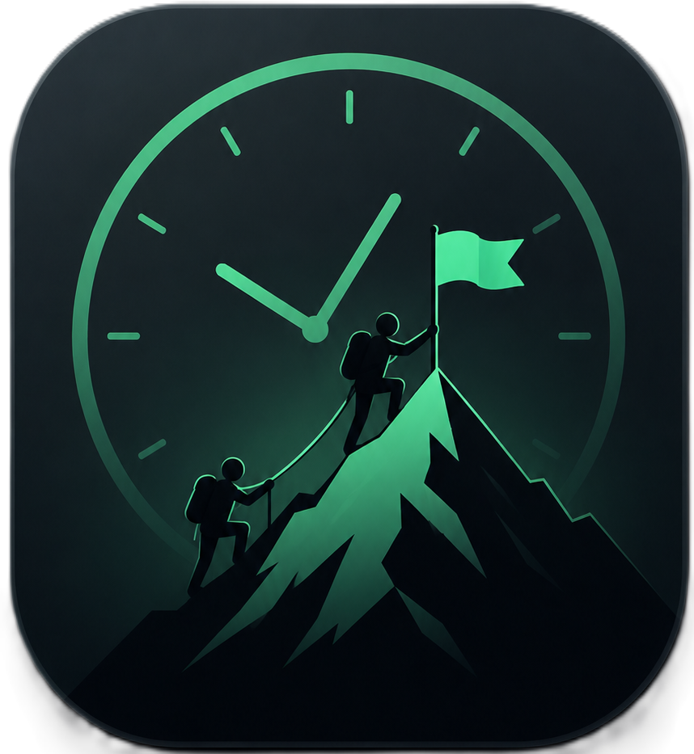

<div align="center">



# HabitPeak

**A premium, offline-first, habit tracker built with Flutter and SQLite.**

[](https://flutter.dev)
[](https://developer.android.com)
[](https://sqlite.org)
[](https://riverpod.dev)
[](LICENSE)
[](https://github.com/ahmedayman2825/HabitPeak/releases/latest)

---

HabitPeak is a modern, privacy-respecting habit tracker designed for high performance and zero friction. No account creation, no cloud servers, no advertisements, no heavy gamification — just a clean, premium, and lightning-fast tool to help you build consistency and reach your peak performance.

[📥 Download APK](https://github.com/ahmedayman2825/HabitPeak/releases/latest) · [🐛 Report a Bug](https://github.com/ahmedayman2825/HabitPeak/issues) · [💡 Request a Feature](https://github.com/ahmedayman2825/HabitPeak/issues)

</div>

---

## ✨ Principles & Philosophy

- **🔒 Complete Privacy:** All habit data is stored locally on your device. No cloud sync, no tracking, and no external dependencies.
- **⚡ Premium Performance:** Lightning-fast cold starts and page transitions. Built-in SQLite indexing ensures instant queries.
- **📈 Stable History (Revision System):** Modifying a habit's target or schedule doesn't warp your historical data. A clean revision history keeps your past progress accurate.
- **📱 Native Integration:** Premium Android Glance home screen widgets that allow viewing progress and completing habits with a single tap.

---

## 📱 Key Features

| Feature | Description |
| --- | --- |
| **📋 Multi-Type Habits** | Track habits with checkboxes (yes/no), numeric inputs (e.g. water tracking), or timers (custom target duration). |
| **🔄 Advanced Recurrence** | Daily, weekly, monthly, specific days of the week, custom intervals, date-bound schedules, or weekday/weekend exclusions. |
| **🔥 Smart Streak Recovery** | Built-in safety net allows you to restore a broken streak up to **twice per month** within a 24-hour grace window from the missed day. |
| **📊 High-Fidelity Analytics** | Beautifully detailed daily, weekly, and monthly charts tracking completion rates, streaks, times, consistency patterns, and scores. |
| **🧩 Home Screen Widgets** | Fully interactive home screen widgets using Android Glance to mark habits as done and check progress on the go. |
| **🔔 Smart Local Reminders** | Customizable local notifications to remind you to complete habits, send summaries, and alert you of missed habits. |
| **💾 Easy Backups & Export** | Secure your data with offline JSON exports/imports, or export your completion history to CSV for custom analysis. |

---

## 📸 Screenshots

<div align="center">

| Home (Light) | Home (Dark) | Analytics | Settings | Create new Habbit |
|---|---|---|---|---|
| | |  | |  |

</div>

---

## 🛠️ Built With

| Layer | Technology |
|---|---|
| **Framework** | [Flutter](https://flutter.dev) (Dart) |
| **State Management** | [Riverpod](https://riverpod.dev) — DI and reactive state boundaries |
| **Database** | SQLite via [sqflite](https://pub.dev/packages/sqflite) |
| **Charts** | [fl_chart](https://pub.dev/packages/fl_chart) — premium performance visuals |
| **Home Widgets** | [home_widget](https://pub.dev/packages/home_widget) with Jetpack Compose Glance |
| **Notifications** | [flutter_local_notifications](https://pub.dev/packages/flutter_local_notifications) |

---

## 📂 Project Architecture

The codebase follows a modular clean architecture:

```
lib/
  ├── app/             # App shell, theme styling, global provider registries
  ├── core/            # Database schema migrations, date utilities, and global helpers
  └── features/        # Modular domain feature folders
        ├── habits/      # Habit creation, type logic, revision engine, and UI cards
        ├── analytics/   # Analytical engine, streak math, score calculation, charts
        ├── timer/       # Persistent timer system that survives app restarts
        ├── notifications/ # Android local notification manager
        ├── widgets/     # Jetpack Compose Glance widget bindings and event callbacks
        ├── backup/      # JSON backup file parsing and CSV reporting
        └── settings/    # Day reset boundaries, themes, and configuration flags
```

---

## 🚀 Getting Started

### Prerequisites

- Install the latest [Flutter SDK](https://docs.flutter.dev/get-started/install) (stable branch).
- Set up an Android Emulator or connect a physical Android device.

### Installation

1. **Clone the repository**

   ```bash
   git clone https://github.com/ahmedayman2825/HabitPeak.git
   cd HabitPeak
   ```

2. **Install dependencies**

   ```bash
   flutter pub get
   ```

3. **Run the application**

   ```bash
   flutter run
   ```

4. **For Android widget development** — ensure home screen widgets are supported on your test device:

   ```bash
   flutter run -d android
   ```

> **Note:** Alternatively, grab the latest pre-built APK from the [Releases page](https://github.com/ahmedayman2825/HabitPeak/releases/latest) and install it directly.

---

## ❓ FAQ

**Q: Why Android only? No iOS support?**
A: HabitPeak relies on Android Glance for interactive home screen widgets, which has no direct iOS equivalent. iOS support may be considered in the future.

**Q: Is my data safe if I uninstall the app?**
A: Use the built-in JSON backup feature (Settings → Backup) before uninstalling. All data is stored locally, so it will be deleted with the app.

**Q: Does it work offline?**
A: Yes, 100%. HabitPeak never makes any network requests.

---

## 🗺️ Roadmap

- [ ] iOS support
- [ ] Habit categories / grouping
- [ ] Rich habit statistics export (PDF reports)
- [ ] Themes & icon customization
- [ ] Tablet / large screen layout
- [ ] Optional encrypted backups

---

## 🤝 Contribution Guidelines

Contributions of all types are welcome! To keep development fast, clean, and organized:

1. Keep business logic inside **Domain/Service providers** and keep presentation layers clean of query logic.
2. Optimize database operations by adding indexes to `app_database.dart` rather than querying large structures inside the UI layer.
3. Add unit or widget tests for any new features or scheduling changes. Check out existing tests in `test/` for references.
4. Ensure all code conforms to the rules specified in `analysis_options.yaml`:

   ```bash
   flutter analyze
   ```

See [CONTRIBUTING.md](CONTRIBUTING.md) for the full guide.

---

## 📄 License

This project is licensed under the MIT License — see the [LICENSE](LICENSE) file for details.
